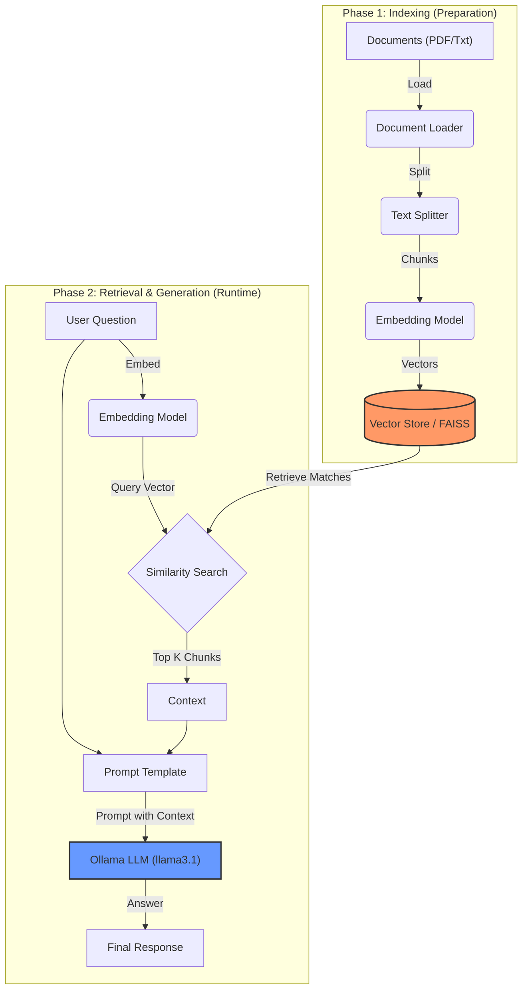

# RAG System Technical Report

This report visualizes and explains what happens under the hood of your RAG (Retrieval-Augmented Generation) system.

## The Workflow at a Glance

There are two main phases in a RAG system: **Indexing** (Loading your data) and **Retrieval & Generation** (Answering your questions).



## detailed Breakdown

### 1. The Indexing Phase (When you click "Process Documents")

1.  **Document Loading**: We scan your `data/` folder and read the raw text from PDF and TXT files using `PyPDFLoader` and `TextLoader`.
2.  **Text Splitting**: LLMs have a limit on how much text they can read at once. We verify the specific logic in `RAGEngine.split_text`. We use `RecursiveCharacterTextSplitter` to chop your large documents into small, manageable "chunks" (e.g., 1000 characters).
3.  **Embedding**: This is the magic part. Each text chunk is passed through an **Embedding Model** (`all-MiniLM-L6-v2`). This model converts the text into a list of numbers (a vector) that represents the *meaning* of that text.
4.  **Vector Store**: These vectors are saved into `FAISS` (Facebook AI Similarity Search). This allows us to quickly search for "semantically similar" text later.

### 2. The Retrieval & Generation Phase (When you ask a question)

1.  **User Query**: You type: *"How does the system work?"*
2.  **Query Embedding**: The same Embedding Model converts your question into a vector.
3.  **Similarity Search**: We compare your question's vector against all the vectors in the Vector Store. We find the "Nearest Neighbors"—the chunks of text that are most similar into meaning to your question.
4.  **Context Construction**: We take the top 3 most relevant chunks and combine them into a single block of text called "Context".
5.  **LLM Generation**: We construct a prompt that looks like this:
    ```text
    Answer the question based only on the following context:
    [...Insert Retrieved Chunks Here...]
    
    Question: How does the system work?
    ```
6.  **Final Response**: We send this full prompt to **Ollama (llama3.1)**. The LLM reads the context and acts as a reasoning engine to synthesize an answer based *only* on the facts provided.

## Why this is powerful?
- **Accuracy**: The model citations are grounded in your actual documents, reducing hallucinations.
- **Privacy**: Since everything (Embeddings, Vector Store, LLM) runs locally on your machine, your data never leaves your computer.

## Deep Dive: The Request Lifecycle

Here is the exact technical path your request takes when using the **LCEL (LangChain Expression Language)** chain:

### 1. The Chain Definition
The code defines a valid chain that looks like this:
```python
chain = (
    {"context": retriever | format_docs, "question": RunnablePassthrough()}
    | prompt
    | llm
    | StrOutputParser()
)
```

### 2. Execution Tracing
When you call `engine.ask("What is FAISS?")`:

| Step | Component | Input | Output (Internal) |
| :--- | :--- | :--- | :--- |
| **1** | `RunnablePassthrough` | `"What is FAISS?"` | `"What is FAISS?"` (Passes through) |
| **2** | `retriever` | `"What is FAISS?"` | `[Document(page_content="..."), ...]` (Top 3 Chunks) |
| **3** | `format_docs` | `[Document(...), ...]` | `"Text of chunk 1...\n\nText of chunk 2..."` (Single String) |
| **4** | `prompt` | `context` + `question` | **Final Prompt String** (See below) |
| **5** | `llm` | **Final Prompt String** | `AIMessage(content="FAISS is a library...")` |
| **6** | `StrOutputParser` | `AIMessage(...)` | `"FAISS is a library..."` (String) |

### 3. The Actual Prompt Sent to the Model
This is the **exact string** that `llama3.1` sees. It has no idea about your PDF files, it only sees this text block:

```text
Answer the question based only on the following context:
FAISS (Facebook AI Similarity Search) is a library for efficient similarity search...
[...more retrieved text...]

Question: What is FAISS?
```

The model simply completes this text. It's "reading" the context we pasted in for it!
